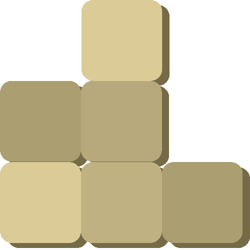
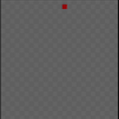

  
  

    <ul style="list-style: none;">
      

        <h2>Sand Simulator</h2>
      

    </ul>
  

  
  
  
  
  
  

## Features

* Move cursor with WASD.
* Place sand with Space.
* Gravity and sand sliding.

 

  
  
  

